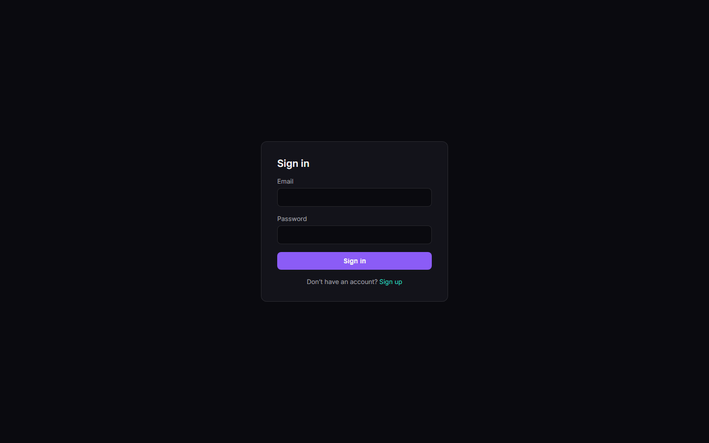
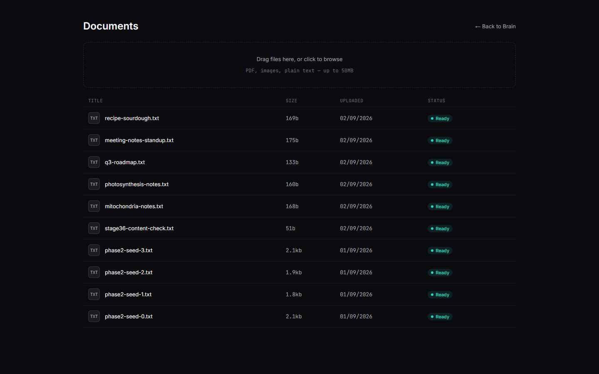
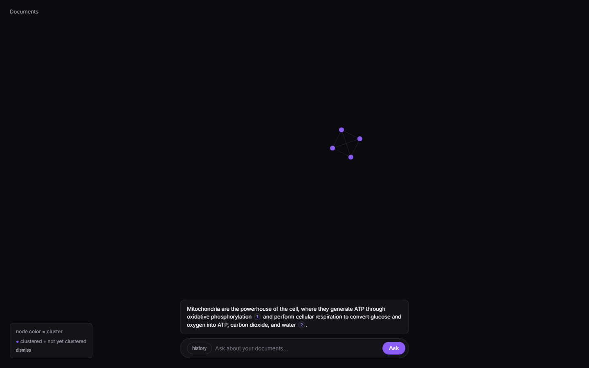

# Cerebro 2.0

A personal multimodal knowledge vault. Upload documents and images, ask
questions in natural language, and watch the answer's real retrieval
play out live on a force-directed "brain graph" — nodes pulse only when
they were actually returned by the retriever, replayed from what was
genuinely stored, never simulated. Sensitive files can be sealed behind
a passphrase: their metadata stays searchable, their content doesn't,
until you unlock them.

## Screenshots

| Sign in | Documents |
|---|---|
|  |  |

**Brain graph + chat**, mid-answer — the numbered chips are real
citations resolved from the retriever's actual output, and the graph
node behind them pulsed live when the answer streamed in:



## Features

- **Hybrid retrieval** — vector search + full-text search, fused with
  Reciprocal Rank Fusion, then reranked. A query with no relevant
  content returns nothing rather than a forced top-k.
- **Multimodal ingest** — text, PDFs, and images, normalized and
  chunked, with a memory-governed pipeline that stays inside a 512MB
  ceiling (streaming I/O, draft-mode image decode, no local models).
- **Live brain graph** — a force-directed visualization of your
  document clusters. Retrieval pulses are real, not decorative:
  replaying a past conversation replays its actual stored
  `retrieved_chunk_ids`.
- **Streaming chat with real citations** — SSE-streamed answers,
  citation markers resolved against the retriever's real output and
  rendered as clickable chips that jump to the source node.
- **Sealed tier** — client-side WebCrypto (Argon2id + AES-256-GCM)
  encrypts a document's content before it ever leaves the browser.
  Sealed content is structurally excluded from the retrieval index and
  every unlock is a short-lived, server-clock-enforced claim scoped to
  one document. Not "encrypted" as a vague adjective and not
  "zero-knowledge" — the derived key does transit to the server per
  request during an active unlock session, by design.
- **Provider fallback** — a document's embedding job locks onto one
  provider (Jina → Voyage → Cohere) for its whole life, so vector
  search never compares across incompatible embedding spaces.

## Tech stack

**Frontend** — Next.js 15 (App Router, Turbopack), React 19, native
Canvas 2D + d3-force for the graph, deployed on Vercel.

**Backend** — FastAPI on Render's free tier (512MB RAM, single
instance), which is what actually shapes a lot of the architecture:
no torch, no local embedding models, streaming I/O throughout, ingest
concurrency capped at 1.

**Data** — Supabase: Postgres + pgvector (`halfvec`, HNSW indexing),
Storage (two isolated buckets — `originals` and `indexed` — retrieval
only ever reads the latter), Auth, and row-level security as the real
authorization boundary throughout, not just an app-layer check.

**AI providers** — Jina (primary embeddings, multimodal), with a
documented fallback chain to Voyage then Cohere; Cohere for reranking;
Google Gemini for generation; Langfuse for tracing every retrieval
span.

## Project status

Built in strict phases, each with its own exit criteria and a gate
that has to pass before moving on — see [`phases-and-gates.md`](phases-and-gates.md)
for the full build log, including real bugs found and fixed live along
the way.

- ✅ **Phase 0** — Foundation (schema, RLS, storage, auth, rate
  limiting, CI)
- ✅ **Phase 1** — Multimodal RAG core (upload, ingest, hybrid
  retrieval, chat, observability)
- ✅ **Phase 2** — Brain graph (clustering, live rendering,
  retrieval-replay animation)
- ✅ **Phase 3** — Sealed tier (schema isolation, client-side crypto,
  seal/unlock API, metadata-only search filtering, adversarial
  security testing, document lifecycle)
- ⏳ **Phase 4** — Kanban, todo, token playground (not started)

## Documentation

- [`CLAUDE.md`](CLAUDE.md) — project context, non-negotiable
  constraints, naming discipline
- [`architecture-and-security.md`](architecture-and-security.md) — data
  model, memory governance, the full security review checklist
- [`api-documentation.md`](api-documentation.md) — the real API
  surface, spec-level
- [`phases-and-gates.md`](phases-and-gates.md) — the build log

## Local development

```
apps/web/       Next.js frontend (reads apps/web/.env.local)
services/api/    FastAPI backend  (reads services/api/.env)
```

Copy `.env.example` into both locations and fill in real values (a
Supabase project, and API keys for whichever providers you're testing).

```bash
# Frontend
cd apps/web
npm install
npm run dev

# Backend
cd services/api
pip install -r requirements-dev.txt
uvicorn app.main:app --reload
```

CI runs lint + unit tests for both on every PR; any red step blocks
merge to `main`.

## License

MIT — see [`LICENSE`](LICENSE).
